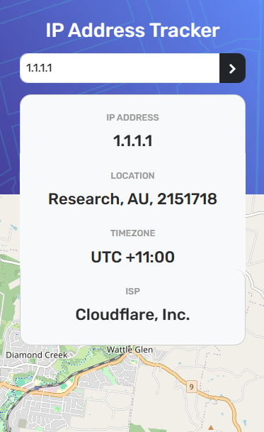

# IP address tracker

The IP Address Tracker is a web application that allows users to view their own IP address information and search for information about any other IP address or domain.

## Table of contents

- [Features](#features)
- [Screenshot](#screenshot)
- [Links](#links)
- [Technologies Used](#technologies-used)
- [Lessons Learned](#lessons-learned)
- [Useful resources](#useful-resources)
- [Acknowledgments](#acknowledgments)

### Features

- View your own IP address information, including location, timezone, and ISP.
- Search for information about any other IP address or domain.
- Display results in a user-friendly interface with a map view.

### Screenshot

### Links

- Live Site: [IP Address Tracker](https://sushcod3.github.io/ip-address-tracker/)

### Technologies Used

- Frontend: HTML, CSS, JavaScript (Vue.js framework)
- Mapping: Leaflet.js for interactive maps
- API Integration: Axios for fetching data from the IP Geolocation API
- Deployment: Hosted on github pages

### Lessons Learned

- **Efficient Data Fetching**: Utilized Axios to seamlessly fetch JSON data and perform HTTP requests, enhancing the project's functionality.

- **Mapping Integration**: Incorporated Leaflet.js, a robust and free mapping API, to integrate interactive maps seamlessly into the project.

- **Understanding Geographical Coordinates**: Gained insight into the significance of longitude and latitude coordinates in pinpointing specific locations on a map.

- **Asynchronous Function Implementation**: Successfully implemented asynchronous function search() for dynamic search functionality, enabling real-time updates based on user input.

- **Reflection on Development Process**: Acknowledged the benefits of adopting a mobile-first approach and the importance of continual reflection on development methodologies.

- **Cost Considerations for APIs**: Recognized the potential expenses associated with utilizing third-party APIs, such as the IP address geolocation API.

### Useful resources

- Icons: [Reshot - Free SVG Icons](https://www.reshot.com/)
- SVG to ICO Converter: [FreeConvert - ICO Converter](https://www.freeconvert.com/ico-converter)

## Acknowledgments

This project is a solution to the challenges provided by [Frontend Mentor](https://www.frontendmentor.io/solutions/ip-address-tracker-vuejs-leafletjs-and-axios-YBwPaYYv5s).
